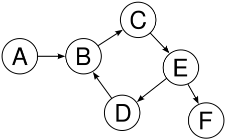

::: frame
:::

::: frame
Sommaire
:::

# Ordonnancement en criticité mixte

::: frame
Ordonnancement en criticité mixte

-   Partager une ou plusieurs ressources entre plusieurs entités

-   Temps réel : contraintes temporelles

-   Notion de criticité

-   Représentation sous forme de travaux $J_i = (r_i, d_i, \chi_i, c_i)$

-   Plusieurs temps d'exécution

-   Considérer deux niveaux de criticité, haut et bas, faible et fort
:::

::: frame
Ordonnancement en criticité mixte

::: exampleblock
Faisabilité CM Il est possible d'agencer les travaux correctement

-   $\forall \ell, \forall J_i : \chi_i \geq \ell \rightarrow$ exécution
    jusqu'à complétion durant $[r_i, d_i)$
:::

::: block
Ordonnançabilité CM Il existe un algorithme en ligne qui permet
d'ordonnancer correctement les travaux

-   Complexe car en ligne

-   Problème NP-difficile
:::
:::

::: frame
Test d'ordonnançabilité

Si un test d'ordonnançabilité échoue, il peut y avoir différentes
raisons

::: exampleblock
Faisabilité Le système en tant que tel n'est pas faisable.

-   Testable par condition sur utilisation
:::

::: block
Ordonnançabilité Le système n'est pas ordonnançable.
:::

::: alertblock
Test Le test est mal fait.
:::

-   Deux derniers cas indissociables actuellement

-   Solution : tester tous les ordonnancements possibles

-   Réduction vers le problème d'accessibilité
:::

# Accessibilité dans un automate

::: frame
Problème d'accessibilité

::: columns
::: column
0.5

-   Graphe, sommets et arcs

-   Automates finis, ensemble de départ et d'arrivée

-   Chemin, séquence d'état adjacent
:::

::: column
0.45


:::
:::

::: block
États accessibles
$Reach(A) = \{v \in V | \exists\ un\ chemin\ v_1,...,v_t : v_1 \in S_0 \wedge v_t = v\}$
:::

-   États d'arrivée $\cap$ États accessibles $\stackrel{?}{=} \emptyset$

-   Recherche en largeur

-   Linéaire en la taille de l'automate
:::

::: frame
Antichaîne

::: block
Relation de simulation Soit $A = (V,E,S_0,F)$ un automate fini, un
préordre $\succeq$ sur $V$ est une relation de simulation pour $A$ si:

-   Pour tout $v_1, v_2, v_3 \in V$, si $v_2 \succeq v_1$ et
    $(v_1, v_3) \in E$, alors il existe $v_4 \in V$ tel que
    $v_4 \succeq v_3$ et $(v_2, v_4) \in E$.

-   Pour tout $v_1, v_2 \in V$, si $v_2 \succeq v_1 : v_1 \in F$
    implique $v_2 \in F$.
:::


::: block
Antichaîne
$H = \{v_1 \in V|\forall v_2 \in V : v_1 \succeq v_2 \Rightarrow v_1 = v_2\}$
:::
:::

# Algorithme d'ordonnancement

::: frame
Vestal & AMC-max

::: block
Vestal

-   Basé sur Audsley

-   Tâche éligible à recevoir la plus faible priorité

-   Pire temps de réponse

-   Taille maximale de l'intervalle compris entre la génération d'un
    travail et sa complétion

-   Doit être inférieur à l'échéance
:::

::: block
AMC-max Décomposé le pire temps de réponse

-   Temps en basse criticité

-   Temps en haute criticité

-   Temps durant le changement de criticité
:::

Si l'assignation de priorité existe, alors le système est ordonnançable.
:::

::: frame
OCBP

::: block
Algorithme

-   Audsley sur travaux

-   Assigner des priorité durant une période occupé

-   Considéré les travaux comme généré au plus tôt

-   Si premption d'un travail car émission d'un autre plus prioritaire,
    recalculer les priorité
:::

::: block
Test

-   Test basé sur la charge de travail

-   Portion de la capacité d'exécution requise pour respecter toutes les
    échéances
:::
:::

::: frame
PLRS & LPA

::: block
PLRS

-   Crée une assignation de priorité pour les travaux

-   Ajuste au vol les priorité, en minimisant le nombre de calcul

-   Nécéssite de calculer la taille de plus grange période occupée

Si l'assignation initiale existe, le système de tâche est ordonnançable.
:::

::: block
LPA

-   PLRS en utilisant une taille de la période occupé mieux bornée

Si l'assignation initiale existe, le système de tâche est ordonnançable.
:::
:::

::: frame
EDF-VD & Greedy

::: block
EDF-VD

-   Utiliser EDF en modifiant les échéance des tâche fortement critique,
    durant le niveau de criticité plus faible.

-   Test sur utilisation.
:::

::: block
Greedy

-   Utiliser EDF en modifiant les échéance.

-   Test sur fonction de borne de demande et d'approvisionement

    -   Fonction de borne de demande en faible criticité

    -   Fonction de borne de demande en haute criticité

    -   Travaux transféré

-   Heurisitique pour trouver les nouvelles échéance.
:::
:::

::: frame
LWLF

-   Basé sur LLF

-   Pire laxité, laxité pour un travail dans le pire des cas, pour son
    pire WCET.

-   Le travail ayant la plus petite pire laxité est ordonnancé.
:::

# Sémantique sous forme d'automate

::: frame
Périodique

::: block
Etat du système Soit $\tau = \tau_1, \tau_2, \tau_3 ...$ un système de
tâches CM périodiques, l'état du système de $\tau$ est le tuple
$S \overset{def}{=} \langle at_S, rct_S, crit_S\rangle$ avec

-   $at_S$, une fonction représentant le temps d'arrivée du travail CM
    courant d'une tâche CM :
    $\tau \rightarrow \mathbb{N},\ at_S(\tau_i) \leq R_{max}$ avec
    $R_{max} \overset{def}{=} max(max_i\ (T_i),\ max_i\ (O_i))$

-   $rct_S$, le temps de calcul restant du travail CM généré par une
    tâche CM :
    $\tau \rightarrow \mathbb{N},\ 0 \leq rct_S(\tau_i) \leq C_{max}$
    avec $C_{max} \overset{def}{=} max_{i,j}\ C_i(j)$

-   $crit_S$, le niveau de criticité actuel du scénario,
    $\in \mathbb{N},\ 1 \leq crit_S \leq K$\
:::

::: block
Transitions

-   Transition d'exécution.

-   Transition de terminaison.

-   Transition critique.
:::
:::

::: frame
Sporadique

::: block
Etat du système Soit $\tau = \tau_1, \tau_2, \tau_3 ...$ un système de
tâches CM sporadiques, l'état du système de $\tau$ est le tuple
$S \overset{def}{=} \langle nat_S, rct_S, done_S, crit_S \rangle$ avec

-   $nat_S$, une fonction représentant le temps d'arrivée minimum du
    prochain travail CM d'une tâche CM :
    $\tau \rightarrow \mathbb{N},\ nat_S(\tau_i) \leq R_{max}$ avec
    $R_{max} \overset{def}{=} max(max_i\ (T_i),\ max_i\ (O_i))$

-   $rct_S$, le temps de calcul restant du travail CM généré par une
    tâche CM :
    $\tau \rightarrow \mathbb{N},\ 0 \leq rct_S(\tau_i) \leq C_{max}$
    avec $C_{max} \overset{def}{=} max_{i,j}\ C_i(j)$

-   $done_S$, la complétion d'un travail CM :
    $\tau \rightarrow \{True,False\}$

-   $crit_S$, le niveau de criticité actuel du scénario,
    $\in \mathbb{N},\ 1 \leq crit_S \leq K$\
:::

::: block
::: columns
::: column
0.6

-   Tâches CM actives, oisives et abandonnées

-   Tâches CM implicitement terminées

-   Tâches CM éligible à la soumission d'un travail
:::

::: column
0.4

-   Criticité réelle d'un état

-   Laxité, pire laxité et états erronés

-   Ordonnanceur
:::
:::
:::
:::

::: frame
Transition d'exécution Soit
$S = \langle nat_S, rct_S, done_S, crit_S \rangle$ un état du système et
$Run$ un *ordonnanceur* pour $\tau$. On dit que l'état du système
$S^+ = \langle nat_S^+, rct_S^+, done_S^+, crit_S^+ \rangle$ est un
*successeur-exécuté* de $S$ avec $Run$, noté $S\xrightarrow{Run}S^+$, si
et seulement si:

-   Pour tout $\tau_i \in Run(S) : rct_S^+(\tau_i) = rct_S(\tau_i)-1$

-   Pour tout $\tau_i \not \in Run(S) : rct_S^+(\tau_i) = rct_S(\tau_i)$

-   Pour tout $\tau_i \in \tau :$ $$nat_S^+(\tau_i) = \left\{
        \begin{array}{ll}
            max(nat_S(\tau_i)-1, 0) & si\ \tau_i \notin Active(S) \\
            nat_S(\tau_i)-1 & si\ \tau_i \in Active(S) 
        \end{array}
    \right.$$

-   $done_{S}^{+} = done_{S}$

-   $crit_{S}^{+} = crit_{S}$\
:::

::: frame
Transition de terminaison Soit
$S = \langle nat_S, rct_S, done_S, crit_S\rangle$ un état du système et
$\tau^T \subseteq Active(S)$ un ensemble de tâches CM actives pouvant
signaler leur complétion. On dit que l'état du système
$S^T = \langle nat_S^T, rct_S^T, done_S^T, crit_S^T \rangle$ est un
*successeur-$\tau^T$-terminé* de $S$, noté $S\xrightarrow{\tau^T}S^T$,
si et seulement si:

-   Pour tout $\tau_i \in \tau^T \cup ImplicitelyDone(S)$ :

    -   $rct_{S}^T(\tau_i) = 0$

    -   $done_{S}^T(\tau_i) = True$

-   Pour tout $\tau_i\ \notin \tau^T \cup ImplicitelyDone(S)$ :

    -   $rct_{S}^T(\tau_i) = rct_{S}(\tau_i)$

    -   $done_{S}^T(\tau_i) = done_{S}(\tau_i)$

-   $nat_{S}^T = nat_{S}$

-   $crit_{S}^T = crit_{S}$\
:::

::: frame
Transition critique Soit
$S = \langle nat_S, rct_S, done_S, crit_S \rangle$ un état du système.
On dit que l'état du système
$S^C = \langle nat_S^C, rct_S^C, done_S^C, crit_S^C \rangle$ est un
*successeur-critique* de $S$, noté $S\xrightarrow{C}S^C$, si et
seulement si :

-   $crit_S^C = Critical_S$

-   Pour tout $\tau_i \in \tau :$

    $$\begin{array}{rl}
    rct_S^C(\tau_i) =  &\left\{
        \begin{array}{ll}
            rct_S(\tau_i)+c_i(Critical_S)-c_i(crit_S) & si\ X_i\geq Critical_S \wedge \tau_i \in Active(S)\\
            rct_S(\tau_i) & si\ X_i\geq Critical_S \wedge \tau_i \notin Active(S)\\
            0 & \mbox{sinon.}
        \end{array}
    \right.\\
     nat_S^C(\tau_i) = &\left\{
        \begin{array}{ll}
            nat_S(\tau_i) & si\ X_i\geq Critical_S \\
            0 & \mbox{sinon.}
        \end{array}
    \right.\\
     done_S^C(\tau_i) = &\left\{
        \begin{array}{ll}
            done_S(\tau_i) & si\ X_i\geq Critical_S \\
            True & \mbox{sinon.}
        \end{array}
    \right.
    \end{array}$$
:::

::: frame
Transition de requête Soit
$S = \langle nat_S, rct_S, done_S, crit_S \rangle$ un état du système et
$\tau^R \subseteq Eligible(S)$ un ensemble de tâches CM éligibles. On
dit que l'état du système
$S^R = \langle nat_S^R, rct_S^R, done_S^R, crit_S^R \rangle$ est un
*successeur-$\tau^R$-requête* de $S$, noté $S\xrightarrow{\tau^R}S^R$,
si et seulement :

-   Pour tout $\tau_i \in \tau^R$ :

    -   $nat_S(\tau_i)+T_i \leq nat_S^R(\tau_i) \leq T_i$

    -   $rct_S^R(\tau_i)=C_i(crit_S)$

    -   $done_S^R(\tau_i) = False$

-   Pour tout $\tau_i\ \notin \tau^R$ :

    -   $nat_S^R(\tau_i)=nat_S(\tau_i)$

    -   $rct_S^R(\tau_i)=rct_S(\tau_i)$

    -   $done_S^R(\tau_i) = done_S(\tau_i)$

-   $crit_S^R = crit_S$\
:::

::: frame
Automate Étant donné un système de tâches CM sporadiques $\tau$ et un
ordonnanceur $Run$, l'automate $\overline{A}(\tau,Run)$ est le tuple
$(V, E, S_0, F)$ où:

-   $V=States(\tau)$

-   $(S_1,S_2) \in E$, si et seulement s'il existe les états
    intermédiaires $S^{+}, S^{T}$ et $S^{C} \in States(\tau)$ et
    $\tau^T \subseteq Run(S_1),\tau^R \subseteq Eligilbe(S^{C})$ tel que
    :\
    $S_1\xrightarrow{Run}S^{+}\xrightarrow{\tau^T}S^{T}\xrightarrow{C}S^{C}\xrightarrow{\tau^R}S_2$

-   $S_0 = (nat_{S_0}, rct_{S_0}, done_{S_0}, crit_{S_0})$ :

    -   $nat_{S_0}(\tau_i) = O_i\ \forall\ i$

    -   $rct_{S_0}(\tau_i) = 0\ \forall\ i$

    -   $done_{S_0}(\tau_i) = True\ \forall\ i$

    -   $crit_{S_0} = 1$

-   $F = Fail_\tau$
:::

::: frame
Exemple I

   i   O   T   D      C       $\chi$
  --- --- --- --- ---------- --------
   0   0   3   3   \[2, 3\]     2
:::

::: frame
Exemple II

   i   O   T   D      C       $\chi$
  --- --- --- --- ---------- --------
   0   0   3   3   \[2, 3\]     2
:::

::: frame
Exemple III

   i   O   T   D      C       $\chi$
  --- --- --- --- ---------- --------
   0   0   3   3   \[2, 3\]     2
:::

::: frame
Simulation de tâche oisive Soit $\tau$ un système de tâches CM
sporadiques. Le préordre de tâches oisives
$\succeq_{idle} \subseteq States(\tau)\times States(\tau)$ est tel que
pour tout $S_1, S_2 : S_2 \succeq_{idle}S_1$, si et seulement si :

-   $crit_{S_2} = crit_{S_1}$

-   $done_{S_2} = done_{S_1}$

-   $rct_{S_2} = rct_{S_1}$

-   Pour tout $\tau_i$ tel que
    $done_{S_1}(\tau_i) = True : nat_{S_2}(\tau_i) \leq nat_{S_1}(\tau_i)$

-   Pour tout $\tau_i$ tel que
    $done_{S_1}(\tau_i) = False : nat_{S_2}(\tau_i) = nat_{S_1}(\tau_i)$\
:::

::: frame
Exemple

   i   O   T   D      C       $\chi$
  --- --- --- --- ---------- --------
   0   0   2   3   \[1, 2\]     2
   0   0   1   1   \[1, 1\]     1

[\[idle:exem:fail\]]{#idle:exem:fail label="idle:exem:fail"}
:::

# Résultats

::: frame
Méthodologie

::: block
Un système de tâches CM à double criticité est généré en commençant avec
un ensemble vide $\tau = \emptyset$ dans lequel des tâches CM aléatoires
sont ajoutées.

-   la probabilité $P_{HI}$ que la tâche CM soit fortement critique

-   le ratio maximum $R_{HI}$ entre le temps d'exécution pour forte
    criticité et faible criticité

-   et la période maximum $T^{MAX}$
:::

1500 systèmes de tâches CM ont été générés avec 2, 3 ou 4 tâches CM par
ensemble
:::

::: frame
Sporadique : avec antichaîne vs sans antichaîne

{#res:spoIdle width="\\textwidth"
height="0.8\\textheight"}
:::

::: frame
Périodique vs sporadique avec antichaîne

{#res:per-idle width="\\textwidth"
height="0.8\\textheight"}
:::

::: frame
Complexité en espace

{#res:nbetat width="\\textwidth"
height="0.8\\textheight"}
:::

::: frame
Méthodologie

::: block
Un système de tâches CM à double criticité est généré en commençant avec
un ensemble vide $\tau = \emptyset$ dans lequel des tâches CM aléatoires
sont ajoutées. La génération des tâches CM est contrôlée par quatre
paramètres :

-   la probabilité $P_{HI}$ que la tâche CM soit fortement critique

-   le ratio maximum $R_{HI}$ entre le temps d'exécution pour forte
    criticité et faible criticité

-   et la période maximum $T^{MAX}$

-   $C^{MAX}_{LO}$, le temps d'exécution maximum pour faible criticité

-   utilisation moyenne objective $U^{*'}$
:::

-   $U^{*'}$ = $0.4 + (x/40) * 0.6$ pour $0 \le x \le 40$

-   Taux sur 2000 simulations

-   4 tâches par systèmes
:::

::: frame
Vestal vs AMC-max

{#res:vestalamc width="\\textwidth"
height="0.8\\textheight"}
:::

::: frame
OCBP, PLRS & LPA

{#res:ocbpbext width="\\textwidth"
height="0.8\\textheight"}
:::

::: frame
EDF-VD

{#res:edfvd
width="\\textwidth" height="0.8\\textheight"}
:::

::: frame
Comparaison

{#res:full
width="\\textwidth" height="0.8\\textheight"}
:::

# Conclusion

::: frame
Conclusion

-   Définition de l'ordonnancement en criticité mixte.

-   Présentation d'une réduction vers l'accessibilité

-   Explication de la notions d'antichaînes

-   Regroupement d'algorithme d'ordonnancement CM

-   Proposition de l'algorithme LWLF

-   Test d'ordonnançabilité par explorations d'automate

    -   Pour système de tâches CM périodique

    -   Pour système de tâches CM sporadiques

    -   Relation de simulation de tâches oisives

```{=html}
<!-- -->
```
-   Performance et exportation de la relation de simulation de tâche
    oisive

-   Démocratisation de l'ordonnancement CM

-   Interdisciplinarité

-   Greedy est un puissant algorithme d'ordonnancement

-   LWLF donne de bon resultats pour des système à haute utilisation

-   Nouvelles possibilités d'exploration de l'ordonnancement CM
:::

::: frame
Travaux ultérieurs

-   Améliorer l'outil

-   Etendre les tests

-   Explorer de nouvelles relation de simulation

-   Approfondir LWLF

-   Recherche d'un algorithme optimal

-   Jeu d'accèssibilité
:::
